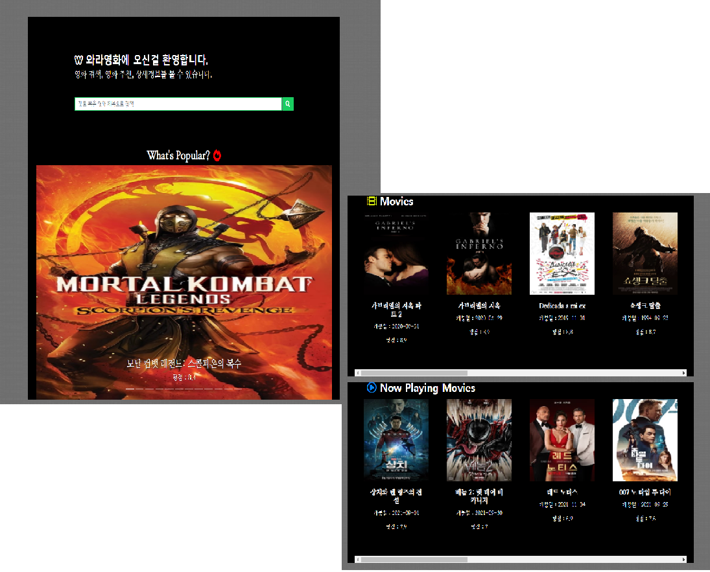

# 종합 프로젝트

## 프로젝트 결과

## 1. 팀

- 팀명 : ALLBBEME
- 프로젝트 진행 날짜 : 2020.11.17 - 2019.11.25

* 역할 분담

  | 팀원   | 업무 내용                                                    |      |
  | ------ | ------------------------------------------------------------ | ---- |
  | 신동호 | 1. ERD 모델구성 <br />2. Django, Vue.js를 활용한 커뮤니티 기능 구현<br />3. Django, Vue.js를 활용한 영화 리뷰 추가 / 수정 / 삭제<br />4. HTML, CSS, BootstrapVue를 활용한 UI 구현 및 디자인 |      |
  | 한승훈 | 1. ERD 모델구성 <br />2. Django, Vue.js를 활용한 영화 요소 구현<br />3. HTML, CSS, BootstrapVue를 활용한 UI 구현 및 디자인 |      |


## 2. 목표 서비스(기획 의도)

##### 	1.  많은 양의 영화 데이터 중 어떤 영화를 봐야하는가?(영화 추천)

##### 	2.  단순히 영화를 보는 것이 아니라 유저들끼리 소통 할 수 있는 커뮤니티 서비스

##### 	3.  포스터만 보는 것이 아닌 세부적인 정보(트레일러영상, 줄거리, 평점 등)을 볼 수 있게 구현

##### 	4.  유저가 특정한 영화 및 장르를 검색가능하게 구현

##### 	5. 자연스럽게 화면전환 (modal 기능 활용)

##### 	6. 유저친화적 디자인 지향

##### 	7. 유저간 팔로우, 좋아요, 영화 북마크 기능 구현


## 3. 프로젝트 설명

### - 프로젝트 소개

​	영화 추천 사이트 와라무비(MovieW)는 영화를 보러 오라는 뜻의 와라와 일본어로 웃긴의 뜻을 가진 W인 동음이의어를 사용한 합성어이다.

본 영화 추천 사이트는 자신의 감정에 따라 보고 싶은 영화를 추천 받고 싶은 사람을 위한 서비스를 제공한다.


### - 주요 기능

- 영화 리스트( 현재 상영중인 영화, 인기있는 영화) 확인
- 영화 리뷰 기록 / 수정 / 삭제
- 기분 및 연도별 영화 추천 받기
- 영화 관련 게시글 작성 / 수정 / 삭제
- 게시글 댓글 작성 / 삭제


### - 개발환경

- Python

  - Python 3.7.7

  - Django 3.1.3

- Vue.js

  - vue/cli 4.5.8

- Database

  - sqlite3


### - 환경 추가 설정

```bash
// vue 환경 다운로드
$ npm install

// django 환경 다운로드
$ pip install -r requirements.txt
// 데이터 파일 다운로드 (migrate 후에 진행할 것)
$ python manage.py loaddata movies.json
```


## 4. 실제 서비스 구현 정도

### - 실제 구현 기능

- 유저의 기분 및 연도별 영화 추천 서비스 기능 구현
- 영화 관련 글을 남길 수 있는 게시판(영화 리뷰 기능)
- 커뮤니티 서비스 및 댓글 기능 및 글자수 제한 구현
- 유저 친화적 디자인 및 자연스러운 화면 전환 기능 구현


### - 구현 미완료 기능

- 유저간 팔로우, 좋아요, 영화 북마크 기능 구현
  - 원인 : vuex를 사용하지 않았기에 JWT토큰을 활용한 로그인 과정에서 유저정보를 확인하기 어려웠다.


### -  구현 화면 (필수 기능 설명)

##### 로그인/회원가입 (로그인과 회원가입 + 로그아웃 기능)


- JWT활용하여 로그인 확인


##### 메인페이지 (영화슬라이드 / 영화리스트 / 이미지)



- 비로그인 상태에서도 조회 가능
- tmdb에서 영화 데이터 파싱하여 영화 리스트 제공
- modal을 이용하여 영화 상세정보 제공


##### 영화 검색결과 (제목 및 장르별 영화리스트 / 상세페이지)


- 비로그인 상태에서도 영화 및 장르 검색 가능
- 리뷰 작성 및 리스트 확인
- 평점 입력 및 추천 기능 구현


##### 추천페이지(감정 및 연도별 영화 추천, 검색기능 추가)


- 작성자의 기분 및 연도별 영화 태그로 영화 추천
- 검색창 기능을 구현하여 영화 제목 및 장르 검색도 가능


##### 커뮤니티 (게시판 및 게시글 상세 페이지)


- 로그인한 회원만 글작성, 자신의 글만 수정, 삭제 기능 구현
- 게시글 정보 제공


- 게시글 제목의 길이 주어진 칸을 벗어나면 ...으로 표시 
  - 스타일안에 text-overflow:ellipsis를 추가
- 게시글의 댓글 글자수가 300byte이상 되면 경고 모달 출현 후 글자수를 299개까지 줄인다.
  - slice() 함수 활용
- 자신의 댓글 삭제 기능 구현


##### 기타 (navigation bar, page footer)

##### navigation bar


- 로고를 클릭하면 메인 페이지로 가게 @click이벤트 추가


##### page footer


## 5. 데이터베이스 모델링(ERD)

### 1. Back-end(Django)


### 2. Front-end(Vue.js)

#### 1. App


#### 2. movies


#### 3. accounts


#### 4. articles


## 6. 느낀 점


### 1) 어려웠던 점

##### 1. django에서 vue에 보내는 데이터에 username이 없을 때

처음엔 Article에서 user를 model의 foreignKey 값으로만 넣어주고, ArticleSerializer는 그대로 받아오기만 했다. 하지만 vue에서 데이터를 불러올 때 user_id만 불러오고 username에 대한 정보는 들어있지 않았다. 

그래서 username에 대한 정보를 함께 넣어주기 위해 get_user_model과 id, username 필드를 활용해 만든 UserInfoSerializer를 만들고 이를 ArticleUserSerializer에 넣어주었다. 이를 통해 유저가 바뀌지 않고 데이터를 수정하는 경우에만 ArticleSerializer를 사용하고, 유저명이 필요한 데이터 호출이나 생성에서는 ArticleUserSerializer를 사용하였다.


##### 2. modal 호출

bootstrap에서 예시로 제공되는 코드는 버튼을 누르면 각 id에 맞는 modal이 호출되는 형식이었다. 하지만 우리는 영화 정보가 담긴 카드들은 여러 개고, modal이 가진 id 값은 하나였기 때문에 하나의 영화 카드를 눌러도 modal은 수십개가 뜨는 문제가 생겼었다. 그렇다고 카드마다 id를 다르게 생성하는 것도 난항을 겪었었다.

이를 해결하기 위해 카드를 클릭할 때 숨겨져있던 modal을 보여주고, modal의 정보는 movie-detail에 component 형태로 데이터를 내려주는 방식을 채택했다.


##### 3. login 시 navbar 업데이트

login하였을 때 navbar에서도 jwt 토큰이 생성된 것을 감지하고 logout을 표시해줘야 한다. 하지만 navbar와 login이 router로 연결되어 있어 emit을 사용하기 어려울 것 같아, updated를 통해 토큰 생성 및 삭제를 감지하여 navbar에 login과 logout을 번갈아가며 표시했다.


##### 4. 검색 결과나 댓글이 없을 때

검색 결과가 존재하지 않거나 댓글이 없을 때 컴포넌트를 완전히 비워두는 것보단 대체할 수 있는 요소를 배치하는 것이 좀 더 자연스러운 사용자 경험이라 생각했다. 처음엔 v-if에 리스트와 null을 등호연산자로 비교한 값을 넣어 조건문을 만들려 했다. 하지만 잘 진행되지 않아, 리스트의 길이를 재서 0과 같을 때 대체 요소를 넣는 방식으로 변경했다.


##### 5. 제목 및 댓글 글자수가 너무 길 때

게시글의 제목이 길 때 게시글 목록을 표시하는 표의 범주를 벗어나는 문제가 있었다. 게시글의 제목을 포함하는 상위요소인 table에 width와 table-layout: fixed 요소를 추가해주고, 제목의 td 태그에는 overflow, white-space, text-overflow 요소를 추가해주어서 일부만 표시해주는 것으로 해결했다.

마찬가지로 댓글 글자수가 너무 길 때도 댓글 목록의 범주를 벗어나는 문제가 있었다. 그래서 width 설정 및 입력한 문자수를 측정하여 300바이트를 넘기면 slice하고 alert 메시지를 표시하도록 했다.


##### 6. 날짜 표시

데이터베이스에 저장되는 날짜는 지나치게 자세하고 길어 그대로 표시해줄 때 가독성이 낮았다. 필터를 사용하려 했지만 잘 되지 않아 moment라는 라이브러리를 설치하고, '연-월-일 시-분-초'를 나타내는 format을 사용해 해결했다.


##### 7. 500 server error

500 서버에러가 뜰때마다 가장 힘들었던 것 같다. 400이나 404와 같이 원인이 정해진 것은 코드를 보며 수정할 수 있지만 500 서버에러가 뜨면 어떤것이 잘못됬는지 하나하나 확인을 해야하기에 어려웠던 것 같다. 처음 에러가 뜰때는 model명이 수정이 안돼서 db초기화 작업을 통해 해결해나갔으며, 대부분 이름명 불일치, 데이터에 없는 모델, 등에서 떴었다. 


### 2) 후기

####  - 한승훈

​	영화 데이터를 tmdb를 통해서 받아왔는데 어떻게 불러와야하고 불러와도 포스터 이미지 경로는 이상하고 계속 고난의 연속이였던 것 같다. 이 부분을 조금더 빨리했다면 다른 기능을 구현했지 않았을까 하는 아쉬움이 있다.

​	와라무비의 전체 페이지들을 하나하나 동호님과 꾸미며 front-end직무의 어려움을 직접 느꼈다. 색상 부터 사진, 이모티콘 등 어느것 하나라도 안어울리면 한숨만 나오고 힘들었었다. 다행히도 네이버, 구글을 통해 여러 사이트를 보며 색의 조합, 이모티콘이 들어간 버튼 등 많은 인사이트를 얻을 수 있었다.

​	유저들에게 추천영화를 어떻게 제공해줘야 좋을까 생각하다가 해쉬태그와 선호도 설문조사를 통한 추천을 생각했는데 해쉬태그는 금방 하였지만 설문조사를 통해 어떻게 추천해줘야할지, 유저 정보를 받아오는등 많은 어려움이 있었다. 그래서 선호도 설문조사를 통한 추천은 못해서 조금 아쉽다. 다음 학기에 비슷한 프로젝트를 한다면 그때는 back-end, front-end를 더 공부해서 구현해보도록 노력하겠다.


####  - 신동호

​	처음에 아키텍처에서 django와 vanila JS를 사용하는 방식, django와 vue.js를 사용하는 방식 두 가지 중 하나를 선택해야 했다. 프론트엔드와 백엔드를 모두 경험해 보고 싶다는 생각에 django와 vue를 병행하였는데, 그러다보니 수업 중에 배웠던 구조와 실제 짜는 코드의 구조가 사뭇 달라 난항을 겪었던 기억이 난다. 

​	가장 복잡했던 부분은 serializer였다. is_valid를 사용할 때마다 오류가 생기고, django에서 serializer에 직접 데이터를 추가하려고 하자 오류에 오류가 끊이질 않았다. 덕분에 is_valid를 사용해야 하는 적절한 상황을 판단하고, 필요한 모든 데이터를 vue에서 django의 serializer로 보내는 방법에 대해서는 도가 트인 것 같다. 특히 print(serializer.errors)와 console.log를 통해 수많은 디버깅으로 문제를 해결할 수 있었다.

​	사실 해낸 부분도 많지만 아쉬운 부분도 많다. 먼저 시간이 부족해 유저들끼리 팔로우 등의 관계를 만들고 북마크나 프로필 기능 등도 구현하려는 계획까지 마치지 못한 것이 아쉽다. 영화 추천 알고리즘도 친구 관계에 있는 유저의 북마크를 기반으로 진행해보려 했었지만 무산되고 말았다. jwt 토큰을 활용하다 보니 현재 로그인 된 유저 정보를 계속 가지고 다니는 것이 어려워서 생긴 문제였다. 추후 vuex를 활용하거나, localstorage에 유저 정보도 따로 저장해둔다면 해결할 수 있을 것 같다.

​	웹사이트를 만들다보니 디자인적인 요소 또한 매우 중요하다는 것을 깨달았다. 수업 중에 사용했던 요소들을 활용하긴 했지만, 기본 제공되는 이미지나 디자인, 색만을 활용하다 보니 이게 정말 예쁜가? 사용자 친화적인 디자인인가? 라는 의문이 계속 들었다. 그래서 naver 등 유명한 웹사이트를 참고하고, fontawesome이나 로고 이미지 제작 사이트 등을 적극적으로 활용했다. 특히 팀원분인 승훈님이 디자인적인 요소를 훌륭하게 활용하셔서 딱딱하게 굳어있던 나의 미적 감각을 다시 돌아볼 수 있는 계기가 되었다. 

​	또 css와 bootstrap, 자바스크립트를 사용하다보니 처음보단 자연스럽게 화면 전환이나 컴포넌트 들을 배치할 수 있었지만 동시에 욕심이 계속 생기기 시작했다.  일단 배치가 내 생각처럼 예쁘게 되지않고 부서지는 경우가 많았고, 자바스크립트를 사용함에도 불구하고 동적인 요소가 부족하단 느낌을 자주 받았다. 나중에 잘 만들어진 웹사이트를 클로닝하거나 미술관에 가서 프론트엔드적인 감각도 키우도록 해봐야겠다.

​	프로젝트를 진행하면서 여러가지 어려움이 있었지만 팀원인 승훈님 덕분에 혼자할 때보다 훨씬 수월하게 진행한 것 같다.  또한 세부 영화 정보를 modal로 표시하거나, 기분에 따라 추천 영화를 제공받는 등 다양한 관점으로 생각해 볼 수 있는 계기가 되었다. 디자인적인 부분에서도 card와 같은 간단한 요소 몇 가지를 추가하는 것만으로도 훨씬 직관적인 UI가 된다는 것도 느꼈다. 이번 1학기 최종 프로젝트를 통해 지금까지 배웠던 내용을 전반적으로 복습할 수 있었고, 협업에서 의견을 주고 받으며 더욱 많은 성장을 이룰 수 있었다.
